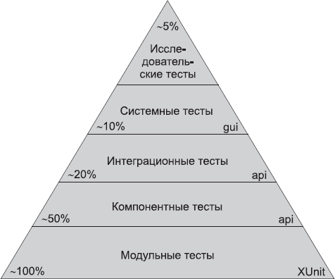

# Идеальный программист (Роберт Мартин)

## Ответственность
#ответственность 

- Не навреди функциональности.

- Написать идеальную программу практически невозможно, но за все недочеты несете ответственность именно вы, и никто другой.

- Верный признак настоящего профессионала - умение отвечать за свои ошибки, появление которых практически неизбежно. 

- Извинения необходимы, но недостаточны.

*Нельзя просто совершать, одни и те же ошибки снова и снова. По мере вашего профессионального становления частота ошибок в вашем коде должна асимптотически стремиться к нулю. Она никогда не достигет нуля, но вы ответственны за то, чтобы она была как можно ближе к нулю.*

- Делай. Или не делай. Не надо пытаться.

- Профессионал обязан поддерживать определенные стандарты. Чистота кода, покрытие тестами, согласованность системы. Многолетнии практический опыт учит нас тому, что нарушение правил только замедляет раооту.


## Служба контроля качества
#тестирование 

>Передавать на контроль качества код, работоспособность которого вы не можете гарантировать, непрофессионально. 

**Такое поведение нарушает правило «не навреди».**

При нахождении ошибок вы обязаны разобраться и предотвратить повторение подобных событий в будущем.

Оптимальная роль службы контроля качества в создании спецификаций и описании характеристик системы. СКЧ должна работать совместно с бизнес-стороной для создания автоматизированных приемочных тестов, которые представляют собой истинную спецификацию и документированные требования к системе.

## Архитектура
#архитектура #tdd

- Код нужно проектировать с расчетом на простоту тестирования. И для этого лучше всего написать тесты сначала - до того кода, который должен их пройти. (TDD)
- Если вы хотите, чтобы ваш код был гибким, его необходимо проверять на гибкость!
- Не бойтесь вернуться и исправить архитектуру. В какой-то момент вы понимаете, что изначально приняли неверное архитектурное решение и ваш код плохо масштабируется в направлении смещения требований. Здесь и находится критическая точка!

## Ката
#тренировка

Ката обычно имеет вид простой задачи по программированию - например, написать функцию, которая раскладывает целое число на простые множители. Целью выполнения ката является не поиск решения; вы уже знаете, как решается задача. Ката тренируют ваши пальцы и ваш мозг.

Ката помогает не забыть конструкции языка или изучить новый язык, написав на нём понятную (с точки зрения логики) программу.

## Бизнес
#бизнес

Проблемы вашего работодателя - это ваши проблемы. Вы должны понимать их и постараться найти лучшие решения.

## Значение слова "НЕТ"
#нет

Как сказать «нет» начальнику? Ведь это ваш начальник! Разве вы не обязаны делать то, что говорит начальник?

>Нет! Говорите «нет», если вы профессионал.

Рабам запрещается говорить «нет». Наемные работники неохотно говорят «нет». Но профессионалу положено говорить «нет». Более того, хорошим руководителям очень нужны люди, у которых хватает смелости сказать «нет». Только так можно действительно чего-то добиться.

*Когда ваш руководитель говорит вам, что страница входа в систему должна быть готова к завтрашнему дню, он преследует и защищает одну из своих целей. Он выполняет свою работу. Если вы хорошо знаете, что сделать страницу к завтрашнему дню невозможно, то отвечая: «Хорошо, я попытаюсь», вы не выполняете свою работу. Выполнить ее в этот момент можно только одним способом: сказать: «Нет, это невозможно».*

## Значение слова "ДА"
#да

>Делай. Или не делай. Не надо пытаться.

"Пытаясь" сделать что-либо, вы обманываете себя, ваших коллег и руководителя. Вы не обещаете что-то сделать, но в то же время создается иллюзия согласия и принятия ответственности. 

Верными признаками серьезных обещаний являются выражения вида: *«Я сделаю то-то... к такому-то времени..»*. Вы утверждаете факт того, что ВЫ что-то сделаете, с указанием четкого момента завершения.

Давая такое устное обязательство, вы не сможете отказаться от него без нарушения обещания. Вы сказали, что сделаете, и теперь возможен только один из двух вариантов: вы либо делаете, либо не делаете. Вы принимаете на себя полную ответственность за что-либо перед аудиторией, состоящей минимум из одного человека.

## Готовность
#готовность

1. Прежде всего ваш код должен работать.
2. Ваш код должен решать задачу, поставленную заказчиком.
3. Ваш код должен хорошо вписываться в сушествующую систему.
4. Ваш код должен нормально читаться другими программистами.
   
Задача завершена, значит: код написан, все тесты пройлены, служба контроля качества и клочевые участники приняли результат.

Профессиональные разработчики расширяют определение требований до автоматизированных приемочных тестов.

## Забота о себе
#самочувствие 

- Не пишите код, когда вы устали. 
  Преданность делу и профессионализм проявляются в дисциплине, а не в продолжительности работы. Обязательно следите за сном, здоровьем и образом жизни, чтобы вы могли ежедневно посвятить работе восемь хороших часов.
- Переработки
  Если ваш начальник не может объяснить, что он собирается делать в случае неудачного исхода, не соглашатесь на сверхурочную работу.
- Сон
  Важность сна невозможно переоценить. Хороший ночной сон восстанавливает большую часть сил и концентрации.
- Перезарядка
  Хорошая долгая прогулка, беседа с друзьями, просто взгляд из окна - все это поможет восстановить резерв сил. Одни люди медитируют. Другие выбирают восстановительный сон. Третьи слушают подкасты или листают журналы.
- Физические упражнения
  


## TDD
#tdd

Почему многие разработчики боятся вносить частые изменения в свой код? Да потому что они боятся его «сломать»! А почему они этого боятся? Потому что у них нет тестов.

Правила TDD:
1. Новый рабочий код пишется только после того, как будет написан модульный тест, который не проходит.
2. Вы пишете ровно такой обьем кода модульного теста, какой необходим для того, чтобы этот тест не проходил (если код теста не компилируется, считается, что он не проходит).
3. Вы пишете ровно такой объем рабочего кода, какой необходим, для прохождения модульного теста, который в данный момент не проходит.

## Приемочное тестирование
#тестирование 

Помните, что принцип «мусор на входе мусор на выходе» применим и к программистам (как говорится, без четкого тз - результат хз).

Разработчики хотят точно знать, что им предстоит сделать, прежде чем давать прогнозы по проекту. Однако, чем точнее требования формулируются, тем быстрее они теряют актуальность в ходе реализации системы.

>Профессиональные разработчики не формулируют требования до того, как будут готовы к разработке.

Контекст. Иногда ключевые участники проекта просто считают, что читатели требований знают, что они имеют в виду.

Больше вопросов. Профессиональные разработчики (и менеджеры) должны следить за тем, чтобы из требований была исключена всякая неоднозначность.

Профессиональные разработчики расширяют определение требований до автоматизированных приемочных тестов.

>Основные цели приемочных тестов - взаимодействие сторон, ясность и точность требований.

*На первый взгляд кажется, что написание подобных приемочных тестов потребует значительных усилий. Но эту работу неправильно называть «лишней». Написание тестов всего лишь явлется работой по определению спецификации системы. Только на таком уровне детализации мы, программисты, понимаем, что означает «выполненная работа». Только на таком уровне детализации ключевые участники проекта могут убедиться в том, что система, за которую они платят, делает то, что требуется. И только на таком уровне детализации возможна успешная автоматизация тестирования. Так что не стоит рассматривать эти тесты как лишнюю работу - лучше рассматривайте их как значительную экономию времени и денег. Тесты предотвратят ошибки в реализации системы и помогут узнать, когда ваша работа завершена*


>Обязательство. Описание приемочных тестов - обязанность бизнес-аналитиков, специалистов по контролю качества или даже разработчиков. Если окажется, что тесты должны писать разработчики, по крайней мере проследите за тем, чтобы это были **не те разработчики**, которые занимаются реализацией тестируемой функциональности.

*Мне известен только один способ эффективного исключения коммуникационных ошибок в общении программистов с ключевыми участниками проектов - написание автоматизированных приемочных тестов. Эти тесты формализованы, полностью однозначны и всегда остаются синхронизированными с приложением. Они являются идеальным документом, определяющим требования к проекту.*

## Автоматическое тестирование
#тестирование 

Приемочные тесты обращаются к системе на значительно более высоком уровне - уровне API или даже уровне пользовательского интерфейса. (тестирование системы)

**UI tests**
*На странице могут находиться несколько кнопок. Вместо создания тестов, имитирующих нажатия кнопок по их положению на странице, следует предусмотреть возможность имитации нажатий с идентификацией по именам. Еще лучше, если у каждой кнопки будет уникальный идентификатор. При написании теста намного приятнее выбирать кнопку с идентификатором ok_button, чем кнопку в столбце 3 строки 4 таблицы элементов*

Бизнес-логику следует тестировать через АРI, a UI с mock-data.

Виды автотестов:
1. Модульные тесты (тестирование функций и классов)
   Модульные тесты углубляются во внутреннюю реализацию системы и вызывают методы конкретных классов. Целью этих тестов является определение спецификации системы на самом нижнем уровне.
2. Компонентные тесты (тестирование фичей)
   В компонентах системы инкапсулируются бизнес-правила, поэтому тесты компонентов становятся приемочными тестами для бизнес-правил.
3. Интеграционные тесты (тестирование взаимодействия фичей)
   Интеграционные тесты являются «хореографическими»: они не тестируют бизнес-правила, а лишь проверяют, насколько хорошо компоненты группы «танцуют» друг с другом.
4. Системные тесты (тестирование системы и флоу)
   Автоматизированные тесты, проверяющие работу всей интегрированной системы. По сути, они представляют собой предельный случай интеграционных тестов.
5. Исследовательские тесты (поиск багов)
   Они предназначены для исследования системы на предмет выявления неожиданного поведения и подтверждения поведения ожидаемого.

Пирамида автоматизации тестирования




## Оценка задачи
#оценка_задачи 

Схема PERT предоставляет очень простой, но исключительно эффективный способ преобразования оценок в вероятностные распределения подходяшие для начальства. При оценке задачи прелоставляются три числа (так называемый анализ по трем переменным):

- О: оптимистическая оценка. Это значение выбирается предельно оптимистичено.
- N: номинальная оценка (наиболее вероятная).
- P: пессимистическая оценка.

Ожидаемая продолжительность равна:
```
u = (O + 4N + P) / 6 
```

Cреднеквадратическое отклонение распределения времени выполнения задачи:
```
q = (P - O) / 6
```

Cуммарная продолжительность по нескольким задачам:
```
U = Σ u 
```

Среднеквадратическое отклонение последовательности (погрешность):
```
Q = √(Σ u²)
```


**Закон больших чисел**
При разбиении большой задачи на несколько меньших и независимой их оценке сумма оценок меньших задач будет более точной, чем одна оценка большей задачи. 

>Разбиение задачи поможет лучше понять ее суть и выявить возможные неожиданности.


## Под давлением
#ответственность 

- Иногда обязательства принимаются за нас. Ответственность за это должен нести тот, кто эти обязательства принял.
- Когда ваш бизнес разваливается, а зарплата откладывается из-за нарушенных обязательств, трудно устоять перед давлением. Но **если вы вели себя профессионально**, то по крайней мере сможете искать новую работу с достоинством и чистой совестью.
- Чтобы двигаться быстро и не нарушать сроков, в коде **необходимо сохранять чистоту**. Профессионал не поддается искушению устроить грязь в коде, чтобы быстро двигаться вперед. Грязно - всегда значит медленно!
- Не изменяйте свое поведение в напряженной ситуации! Если вы попали в трудную ситуацию, доверяйте своим методам. Они для того и нужны, чтобы помочь вам выбраться из тяжелой ситуации. В такое время следует особенно тщательно следить за соблюдением правил, а не ставить их под вопрос или отказываться от них.
  
  >Выберите те методы, с которыми вы комфортно ощущаете себя в кризисной ситуации. А потом используйте их постоянно. Использование этих методов - лучшии способ избежать кризиса.

- Самое худшее, что вы можете сделать, - это спешка! Боритесь с этим искушением любой ценой. Спешка только затянет вас еще глубже на дно.
- Избегайте сюрпризов. Уведомите свою группу и начальство о неприятностях. Изложите свой план по выходу из кризиса. Ничто не сердит людей и не делает их менее рациональными так, как сюрпризы. Сюрпризы повышают уровень стресса десятикратно. 

  