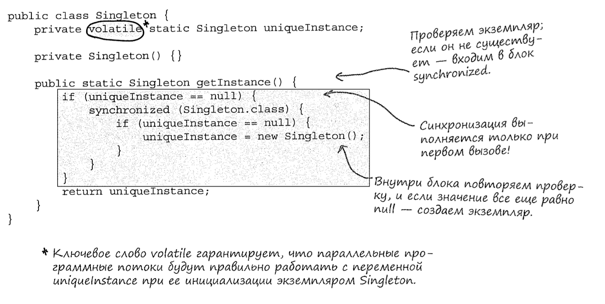

## Концепции ООП

1. Абстракция
2. Инкапсуляция
3. Полиморфизм
4. Наследование

## Принципы проектирования

1. **Выделите аспекты приложения, которые могут изменяться, и отделите их от тех, которые всегда остаются постоянными.**

> Выделите то, что изменяется, и «инкапсулируйте» эти аспекты, чтобы они не влияли на работу остального кода.
> Результат? Меньше непредвиденных последствий от изменения кода, большая гибкость ваших систем!

**Выделите переменные составляюшие и инкапсулируйте их, чтобы позднее их можно было изменять или расширять без воздействия на постоянные составляющие.**

2. **Программируйте на уровне интерфейса, а не на уровне реализации.**
   
3. **Отдавайте предпочтение композиции перед наследованием.**
   
4. **Стремитесь к слабой связанности взаимодействующих объектов.**

>На базе слабосвязанных архитектур строятся гибкие ОО-системы, которые хорошо адаптируются к изменениям благодаря минимальным зависимостям между объектами.

5. **Принцип открытости-закрытости**

*Open-Closed Principle -> O in S**O**LID*

**Классы должны быть открыты для расширения, но закрыты для изменения.**

>Наша цель заключается в том, чтобы классы можно было легко расширять новым поведением без изменения существующего кода.

**Будьте осторожны с выбором расширяемых областей. ПОВСЕМЕСТНОЕ применение принципа открытости / закрытости неэффективно и расточительно, оно приводит к созданию сложного, малопонятного кода.**

6. **Принцип инверсии зависимостей**

*Dependency Inversion Principle-> D in SOLI**D***

**Код должен зависеть от абстракций, а не от конкретных классов.**

>**Что именно инвертируется в принципе инверсии зависимостей?**
>*«Инверсия» в названии принципа объясняется тем, что этот принцип инвертирует традиционный подход к ОО-проектированию. Взгляните на диаграмму и обратите внимание на зависимость низкоуровневых компонентов от абстракции более высокого уровня. Высокоуровневый компонент тоже привязывается к той же абстракции. Таким образом, и высокоуровневые, и низкоуровневые модули зависят от абстракции.*

- **Ссылки на конкретные классы не должны храниться в переменных.**
При использовании new сохраняется ссылка на конкретный класс. Используйте фабрику!

- **В архитектуре не должно быть классов, производных от конкретных классов.**
Наследование от конкретного класса создает зависимость от него. Определяйте классы производными от абстракций - интерфейсов или абстрактных классов.

- **Методы не должны переопределять методы, реализованные в каких-либо из его базовых классов.**
Если вы переопределяете реализованный метод, значит, базовый класс был плохой абстракцией. Методы, реализованные в базовом классе, должны использоваться всеми субклассами.

7. **Принцип минимальной информированности**

>Принцип минимальной информированности: общайтесь только с близкими друзьями.

Принцип дает некоторые рекомендации. Возьмем произвольный объект: согласно принципу, из любого метода этого обьекта должны вызываться только методы, принадлежащие:
- самому объекту;
- объектам, переданным в параметрах метода;
- любому объекту, созданному внутри метода;
- любым компонентам объекта

**Эти правила запрещают вызывать методы для объектов, полученных в результате вызова других методов**

*Под «компонентом» следует понимать любой объект, на который ссылается переменная экземпляра. Иначе говоря, речь идет об объекте, связанном отношением типа СОДЕРЖИТ.*

8. **Голливудский принцип**

>Не вызывайте нас - мы вас сами вызовем.

Голливудский принцип указывает на то, что решения должны приниматься модулями высокого уровня, которые знают, как и когда обращаться с вызовами к модулям низкого уровня.

*Голливудский принцип помогает предотвратить «разложение зависимостей» - явление, при котором компоненты высокого уровня зависят от компонентов низкого уровня, которые зависят от компонентов низкого уровня, которые зависят...*

9. **Принцип одной обязанности**

>Класс должен иметь только одну причину для изменения.

Один класс - одна обязанность. 

*Каждая обязанность класса является областью потенциальных изменений. Несколько обязанностей несколько причин для изменения.*

**Принцип рекомендует ограничить каждый класе одной обязанностью.**

***Связность** - термин, часто используемый для оценки логического единства функций класса или модуля. Мы говорим, что модуль или класс обладает высокой связностью, если он спроектирован для выполнения группы взаимосвязанных функций. Классы с низкой связностью проектируются на основе набо ра разрозненных функций.*

## Классификация паттернов

- **Порождающие паттерны** связаны с созданием экземпляров объектов; все они обеспечивают средства логической изоляции клиента от создаваемых объектов
- **Поведенческие паттерны** относятся к взаимодействиям и распределению обязанностей между классами и объектами.
- **Структурные паттерны** объединяют классы или объекты в более крупные структуры.

- **Паттерны классов** описывают определение отношений между классами посредством **наследования**. Отношения в паттернах классов определяются на стадии компиляции.
- **Паттерны объектов** описывают отношения между объектами, прежде всего относящиеся к **композиции**. Отношения в паттернах объектов обычно определятся на стадии выполнения, а следовательно, обладают большей динамичностью и гибкостью.

## Паттерны проектирования

### Стратегия

>Паттерн Стратегия определяет семейство алгоритмов, инкапсулирует каждый из них и обеспечивает их взаимозаменяемость. Он позволяет модифицировать алгоритмы независимо от их использования на стороне клиента.

### Наблюдатель

> Паттерн Наблюдатель определяет отношение «один-ко-многим» между объектами таким образом, что при изменении состояния одного объекта про исходит автоматическое оповещение и обновление всех зависимых объектов.

Паттерн Наблюдатель определяет отношение типа «Один-ко-многим» между объектами. Когда состояние одного объекта изменяется, все зависимые объекты получают оповещения.

Субъекты обновляют наблюдателей через единый интерфейс.
Субъект ничего не знает о наблюдателях - кроме того, что они реализуют интерфейс Observer.
При использовании паттерна возможен как запрос, так и активная доставка данных от субъекта (запрос считается более «правильным»).

Работа кода не должна зависеть от порядка оповещения наблюдателей.

### Декоратор

>Паттерн Декоратор динамически наделяет объект новыми возможностями и является гибкой альтернативой субклассированию в области расширения функциональности.

Наследование - одна из форм расширения, но оно не всегда обеспечивает гибкость архитектуры.

Композиция и делегирование часто используются для динамического добавления нового поведения.

Типы декораторов соответствуют типам декорируемых компонентов (реализуют один и тот же интерфейс или абстрактный класс).

Декораторы изменяют поведение компонентов, добавляя новую функциональность до и (или) после (или даже вместо) вызовов методов компонентов.

Компонент может декорироваться любым количеством декораторов.

Декораторы обычно прозрачны для клиентов компонента

### Простая Фабрика

>Паттерн Фабрика инкапсулирует создание объекта в одном классе, и будущие изменения реализации придется вносить только в одном месте.

### Фабричный Метод
> Паттерн Фабричный Метод определяет интерфейс создания объекта, но позволяет субклассам выбрать класс создаваемого экземпляра. Таким образом, Фабричный Метод делегирует операцию создания экземпляра субклассам

Главный инструмент метода - **НАСЛЕДОВАНИЕ**

**Вся суть паттерна Фабричный Метод заключается в использовании субкласса, который создает объекты за вас.**

>Задача фабричного Метода - перемещение создания экземпляров в субклассы.

### Абстрактная Фабрика
>Паттерн Абстрактная Фабрика предоставляет интерфейс создания семейств взаимосвязанных или взаимозависимых объектов без указания их конкретных классов.

Главный инструмент метода - **КОМПОЗИЦИЯ**

**Вся суть паттерна Абстрактная Фабрика заключается в том, что вы создаете экземпляр и передаете его коду, написанному для абстрактного типа.**

**В Абстрактной Фабрике прячется Фабричный Метод?**

*Хорошее наблюдение! Да, методы Абстрактной Фабрики часто реззуются как фабричные методы. И это вполне логично, не правда ли?
Задача Абстрактной Фабрики - определить интерфейс для создания набора продуктов. Каждый метод этого интерфейса отвечает за создание конкретного продукта, и мы реализуем субкласс Абстрактной Фабрики, который предоставляет эти реализации. Таким образом, фабричные методы являются естественным способом реализации методов продуктоя в абстрактных фабриках.*

>Задача Абстрактной фабрики - создание семейств взаимосвязанных объектов без зависимости от их конкретных классов

### Одиночка
> Паттерн Одиночка гарантирует, что класс имеет только один экземпляр, и предоставляет глобальную точку доступа к этому экземпляру.

### Команда
>Паттерн Команда инкапсулирует запрос в виде объекта, делая возможной параметризацию клиентских объектов с другими запросами, организацию очереди или регистрацию запросов, а также поддержку отмены операций.

Команда - не более чем упакованный блок вычислений. Команды позволяют определить общий интерфейс для поведения многих разных приемников, каждый из которых обладает собственным набором действий

- Паттерн Команда отделяет обьект, выдающий запросы, от обьекта, который умеет эти запросы выполнять.
- Объект команды инкапсулирует получателя с операцией (или набором операций).
- Инициатор вызывает метод execute() объекта команды, что приводит к выполнению соответствующих операций с получателем.
- Возможна параметризация инициаторов командами (даже динамическая во время выполнения).
- Команды могут поддерживать механизм отмены, восстанавливающий объект в состоянии до последнего вызова метода execute().
- Макрокоманды - простое расширение паттерна Команда, позволяющее выполнять, цепочки из нескольких команд. В них также легко реализуется механизм отмены.

### Адаптер
>Паттерн Адаптер преобразует интерфейс класса к другому интерфейсу, на который рассчитан клиент. Адаптер обеспечивает совместную работу классов, невозможную в обычных условиях из-за несовместимости интерфейсов.

Если вам понадобится использовать существующий класс с неподходящим интерфейсом - используйте адаптер. Адаптер приводит интерфейс к тому виду, на который рассчитан клиент.

### Фасад

> Паттерн Фасад предоставляет унифицированный интерфейс к группе интерфейсов подсистемы. Фасад определяет высоко уровневый интерфейс, упрощающий работу с подсистемой.

Если вам понадобится упростить большой интерфейс или семейство сложных интерфейсов - используйте фасад. Фасад изолирует клиента от сложной подсистемы.

### Шаблонный Метод

> Паттерн Шаблонный Метод задает «скелет» алгоритма в методе, оставляя определение реализации некоторых шагов субклассам. Субклассы могут переопределять некоторые части алгоритма без изменения его структуры.

- Абстрактный класс Шаблонного Метода может определять конкретные методы, абстрактные методы и перехватчики.
- Абстрактные методы реализуются субклассами  
- Перехватчики не делают ничего или определяют поведение по умолчанию в абстрактном классе, но могут переопределяться в субклассах.
- Паттерны Стратегия и Шаблонный метод инкапсулируют алгоритмы: один использует наследование, а другой - композицию. 
- Фабричный Метод является специализированной версией Шаблонного Метода.

### Итератор

>Паттерн Итератор предоставляет механизм последовательного перебора элементов коллекции без раскрытия ее внутреннего представления.

Паттерн Итератор обеспечивает перебор элементов коллекции без раскрытия реализации. Кроме того, перебор элементов выполняется объектом итератора, а не самой коллекцией. Это упрощает интерфейс и реализацию коллекции, а также способствует более логичному распределению обязанностей.

При использовании итераторов коллекция избавляется от одной обязанности (поддержки операций перебора данных).

Итератор предоставляет общий интерфейс перебора элементов коллекции, что позволяет применять полиморфизм в коде, использующем элементы коллекции.

### Компоновщик

>Паттерн Компоновщик объединяет объекты в древовидные структуры для представления иерархий «часть/целое». Компоновщик позволяет клиенту выполнять однородные операции с отдельными объектами и их совокупностями.

Паттерн Компоновщик позволяет создавать древовидные структуры, узлами которых являются как комбинации, так и отдельные объекты. В такой структуре одни и те же операции могут применяться и к комбинациям, и к отдельным объектам. Иначе говоря, во многих случаях различия между комбинациями и отдельными объектами игнорируются.

### Состояние

> Паттерн Состояние управляет изменением поведения объекта при изменении его внутреннего состояния. Внешне это выглядит так, словно объект меняет свой класс.

Один момент! Диаграмма классов паттерна Состояние полностью совпадает с диаграммой паттерна Стратегия!

***Паттерн Состояние** = конечные автоматы. Паттерн реализует концепцию стратегии и при определенных условиях (внутреннее состояние) подставляет конкретный класс, реализующий общий интерфейс состояния.*

- Паттерн Состояние позволяет объекту иметь много разных вариантов поведения в зависимости от его внутреннего состояния.
- Поведение контекста реализуется делегированием выполняемых операций текущему объекту состояния, с которым он связан посредством композиции.
- Переходами между состояниями могут управлять как классы состояний, так и классы контекстов.

### Заместитель (Proxy)

> Паттерн Заместитель предоставляет суррогатный объект, управляющий доступом к другому объекту.

Используйте паттерн Заместитель для создания объекта, управляющего доступом к другому объекту - удаленному, защищенному требующему слишком больших затрат при создании и т.д.

Разновидности заместителей:
1. **Фильтрующий Заместитель** управляет доступом к группам сетевых ресурсов, защищая их от «недобросовестных» клиентов.
2. **Умная Ссылка** обеспечивает выполнение дополнительных действий при обращении к объекту (например, изменение счетчика ссылок).
3. **Кэширующий Заместитель** обеспечивает временное хранение результатов высокозатратных операций.Также может обеспечивать совместный доступ к результатам для предотвращения лишних вычислений или пересылки данных по сети.
4. **Синхронизирующий заместитель** предоставляет безопасный доступ к объекту из нескольких программных потоков.
5. **Упрощающий заместитель** скрывает сложность и управляет доступом к сложному набору классов. Иногда по очевидным соображениям называется **Фасадным Заместителем**. Упрощающий Заместитель отличается от паттерна Фасад тем, что первый управляет доступом, а второй только предоставляет альтернативный интерфейс.
6. **Заместитель Отложенного Копирования** задерживает фактическое копирование объекта до момента выполнения операций с копией.

*На структурном уровне паттерны Заместитель и Декоратор похожи, но они различаются по своим целям. Паттерн Декоратор расширяет поведение объекта, а Заместитель управляет доступом.*

### Мост

>Паттери Мост позволяет изменять реализацию и абстракцию, для чего они размещаются в двух разных иерархиях классов.

*Архитектура состоит из двух иерархий: абстракций и для конкретных реализаций. Паттерн Мост позволяет изменять каждую из двух иерархий независимо от другой иерархии.*

- Логическоеотделение реализации от интерфейса.
- Абстракция и реализация могут расширяться независимо друг от друга.

### Строитель

>Паттерн Строитель инкапсулирует конструирование продукта и позволяет разделить его на этапы.

- Инкапсуляция процесса создания сложного объекта.
- Возможность поэтапного конструирования объекта с переменным набором этапов (в отличие от «одноэтапных» фабрик).
- Сокрытие внутреннего представления продукта от клиента.

### Цепочка обязанностей (middleware)

>Паттерн Цепочка Обязанностей используется, когда вы хотите предоставить нескольким объектам возможность обработать запрос.

- Логическая изоляцияотправителя запроса от получателей.
- Объект упрощается, поскольку ему не нужно ни знать структуру цепочки, ни хранить прямые ссылки на ее элементы.
- Возможность динамического добавления или удаления обязанностей посредством изменения элементов цепочки или их порядка.
- Обработка запроса не гарантирована; если событие не будет обработанони одним объектом, оно просто выходит сконца цепочки (этоможет быть какдостоинством, таки недостатком).
- Цепочки могут усложнять отслеживание запросов и отладку.

### Приспособленец

>Используйте паттерн Приспособленец, если один экземпляр класса может предоставлять много «виртуальных экземпляров».

- Сокращение количества экземпляров класса во время выполнения (экономия памяти).
- Централизованное хранение состояния многих «виртуальных» объектов.
- Приспособленец используется в том случае, когда класс имеет много экземпляров, которыми можно управлять одинаково.
- Недостаток паттерна Приспособленец заключается в том, что после его реализации отдельные экземпляры класса уже не смогут обладать собственным поведением, независимым от других экземпляров

### Интерпретатор

>Паттерн Интерпретатор используется для создания языковых интерпретаторов.

В паттерне Интерпретатор определяется представление своей грамматики в виде класса вместе с интерпретором для обработки серий.

*Интерпретация языка осуществляется вызовом метода interpret() для каждого типа выражения. Метод получает контекст (содержащий входной поток разбираемой
программы), идентифицирует входные данные и обрабатывает их.*

- Представление правил грамматики в виде классов упрощает реализацию языка
- Так как грамматика представлена классами, вы можете легко изменять и расширять язык.
- Включение дополнительных методов в структуру классов позволяет добавлять новое поведение, не связанное с интерпретацией. Скажем, форматированный вывод или проверку корректности интерпретируемого кода.
- При большом количестве грамматических правил реализация становится громоздкой и неуклюжей. В таких случаях лучше воспользоваться парсером/компилятором.

### Посредник

>Паттерн Посредник используется для централизации сложных взаимодействий и управляющих операций между объектами

- Расширение возможностей повторного использования кода обьектов, находящихся под управлением посредника.
- Упрощение сопровождения системы за счет централизации управляющей логики.
- Упрощение сообщений, передаваемых между объектами в системе

### Хранитель

>Паттерн Хранитель используется для реализации возврата к одному из предыдущих состояний

*В соответствии с принципом единой обязанности состояние желательно хранить отдельно от ключевого объекта. Отдельный объект, в котором хранится состояние, называется хранителем.*

- Хранитель используется для сохранения состояния.
- Хранение состояния отдельно от ключевого объекта улучшает связность системы.
- Инкапсуляцияданных ключевого объекта.
- Простая реализация восстановления.

### Прототип

>Паттерн Прототип используется в тех случаях, когда создание экземпляра класса требует больших затрат ресурсов или занимает много времени.

*Ключевой момент этого паттерна заключается в том, что клиентский код может создавать новые экземпляры, не зная, экземпляр какого конкретного класса при этом создается.*

- Сложности создания новых экземпляров остаются скрытыми от клиента.
- У клиента появляется возможность генерировать объекты, тип которых ему неизвестен.
- В некоторых обстоятельствах копирование эффективнее создания нового объекта.
- Прототип обычно применяетсяв системах, создающихновые объекты разных типов из сложной иерархии классов
- Создание копии объекта иногда бывает нетривиальной операцией.

### Посетитель

>Паттерн Посетитель используется для расширения возможностей комбинации объектов в том случае, если инкапсуляция не существенна.

- Возможность добавления операций в составную стурктуру без изменения самой структуры.
- Добавление новых операций выполняется относительно просто.
- Централизация кода операций, выполняемых посетителем.
- Использование паттерна Посетитель нарушает инкапсуляцию составной структуры.

