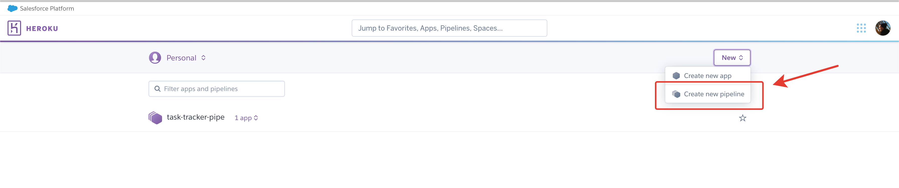
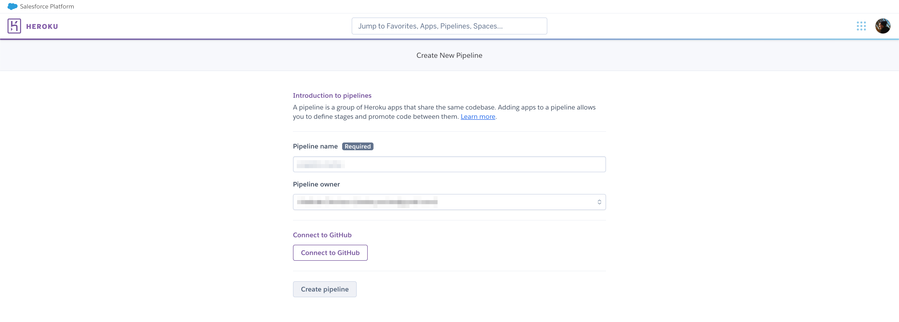
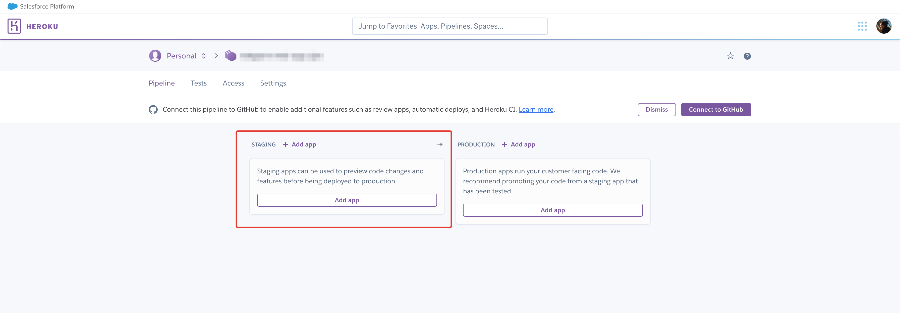
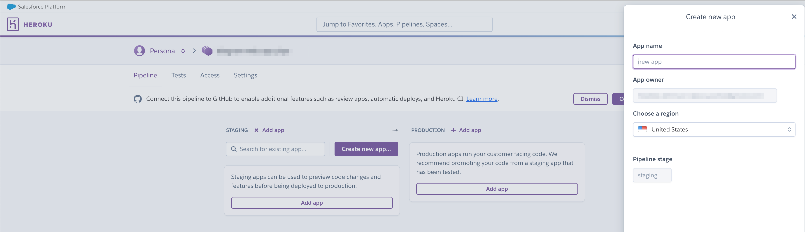
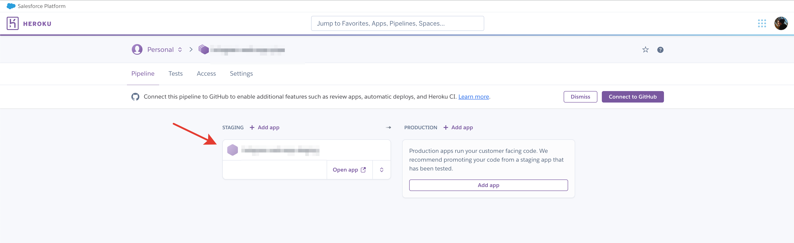
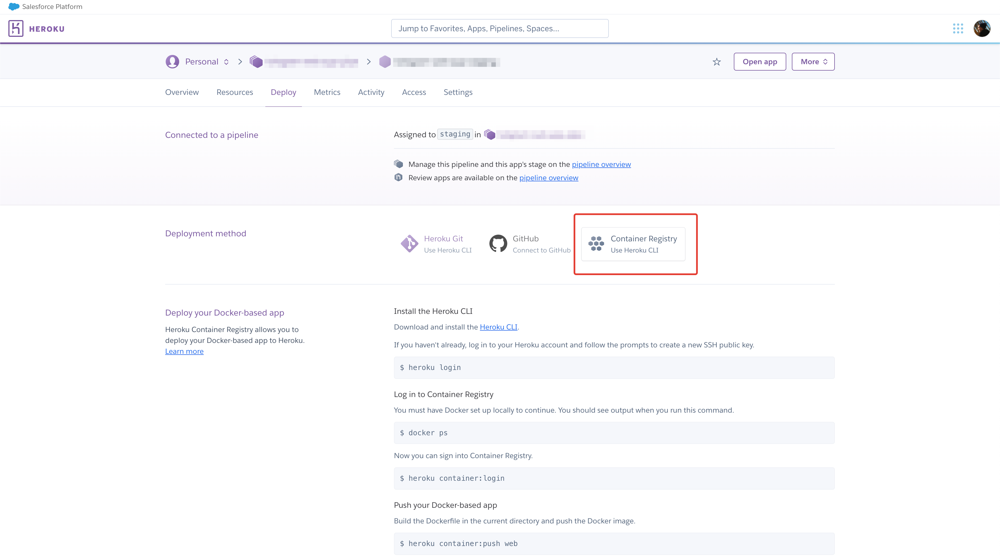
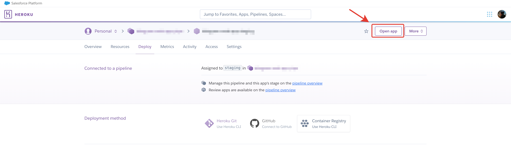

# Как деплоить на heroku.com с Docker

```
Предисловие: 

Аккаунт должен быть уже создан и должен быть прокинут SSH ключ.
Туториал начинается с момента создания пайпа.
```
1. Заходим на дашборд [heroku](https://dashboard.heroku.com/apps).

2. Создадим новый пайп (create new pipeline).



3. Введем название пайпа, выберем владельца и при необходимости можем подключить аккаунт GitHub для CI/CD. В данный момент ограничимся только названием пайпа и владельцем.



4. Создадим staging app.



5. Введем название приложения и выберем локацию хоста.



6. Перейдем в созданное приложение.



7. Переходим во вкладку Deploy. В пункте Deployment method выбираем Container Registry, чтобы можно было задеплоить приложение с использованием Docker.



8. Переходим в терминал и устанавливаем [heroku cli](https://devcenter.heroku.com/articles/heroku-cli). 

MacOS:

```
brew tap heroku/brew && brew install heroku
```

9. Логинимся в heroku.

```
heroku login
```

10. Переходим в папку с проектом и собираем docker-image

```
docker build -t APP_NAME:1.0.0 .
```

11. Проверяем работоспособность. Запускаем docker-container и переходим на 80 порт localhost.

```
docker run -d -p 80:80 --rm --name APP_NAME APP_NAME:1.0.0
```

12. Логинимся в heroku container.

```
heroku container:login
```

13. Запушим контейнер в heroku.

```
heroku container:push web --app APP_NAME
heroku container:release web --app APP_NAME
```

14. Откроем логи приложения.
```
heroku logs --tail --app APP_NAME
```

15. Откроем приложение в браузере.



16. Радуемся. Всё работает! Вы великолепны!

